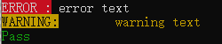

# ColorConsole C++彩色控制台输出

对win32api的简单封装

## 安装

引入头文件即可

```c++
#include "ColorConsole.h"
```

## 使用

```C++
#include "ColorConsole.h"
int main()
{
	using namespace ColorConsole;
	// ConsoleColor参数顺序为RGB，win32api只支持8位色彩
	ColorPrintA("ERROR :\t", ConsoleColor(1, 1, 1), ConsoleColor(1, 0, 0));
	ColorPrintA("error text\n", ConsoleColor(1, 1, 1), ConsoleColor(0, 0, 0));
	ColorPrintA("WARNING:\t", ConsoleColor(0, 0, 0), ConsoleColor(1, 1, 0));
	ColorPrintA("warning text\n", ConsoleColor(1, 1, 0), ConsoleColor(0, 0, 0));
	ColorPrintA("Pass\n", ConsoleColor(0, 1, 0), ConsoleColor(0, 0, 0));
	return 0;
}
```

## 效果

Windows Terminal:


cmd:



如果`ColorConsole.h`打开后中文部分乱码，请使用utf-8编码打开文件